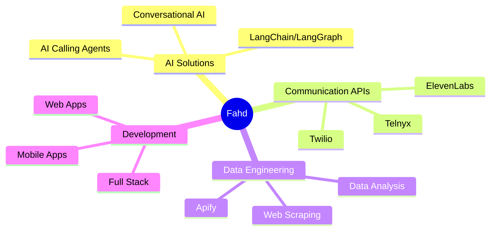

<div align="center">
  
</div>

<div align="center">
  
  [](https://github.com/fahd-111)
  [](https://github.com/fahd-111? tab=followers)
  [](https://github.com/fahd-111)
  
</div>

---

## 👨‍💻 About Me

```typescript
const fahd = {
    role: "Software Engineer @ Credminds",
    location: "Building the future with AI 🌍",
    currentFocus: ["AI-Powered Solutions", "Full-Stack Development", "Mobile Apps"],
    code: ["Python", "JavaScript", "TypeScript", "Dart", "Java"],
    technologies: {
        ai_ml: ["LangChain", "LangGraph", "OpenAI", "AI Analysis"],
        communications: ["Telnyx", "ElevenLabs", "Twilio"],
        scraping: ["Apify", "Beautiful Soup", "Selenium"],
        backend: ["Node.js", "Express", "FastAPI", "Django"],
        frontend: ["React", "Next.js", "Vue.js"],
        mobile: ["Flutter"],
        databases: ["MongoDB", "PostgreSQL", "Firebase"],
        tools: ["Docker", "Git", "AWS", "GCP"]
    },
    specialties: [
        "🤖 AI-Powered Calling Agents",
        "📊 Data Scraping & Analysis",
        "🌐 Full-Stack Web Applications",
        "📱 Cross-Platform Mobile Apps",
        "☁️ Cloud Architecture"
    ],
    funFact: "I turn coffee into AI-powered solutions ☕️➡️🤖"
};
```

---

## 🚀 What I'm Working On

- 🤖 Building **AI-powered calling agents** with advanced conversational capabilities
- 🔗 Integrating **LangChain & LangGraph** for intelligent workflow automation
- 📞 Implementing voice solutions using **Telnyx, ElevenLabs & Twilio**
- 🕷️ Creating sophisticated **data scraping pipelines** with Apify
- 📊 Developing **AI-driven analytics** for actionable insights
- 🌐 Crafting responsive **web applications** with modern frameworks
- 📱 Building beautiful **Flutter mobile apps** for iOS & Android

---

## 🛠️ Tech Stack

### Languages


### AI & Communication


### Frameworks & Libraries


### Databases & Cloud


---

## 📊 GitHub Stats

<div align="center">
  
  
</div>

<div align="center">
  
</div>

<div align="center">
  
</div>

---

## 📈 Contribution Graph

<div align="center">
  
</div>

---

## 🎯 Current Focus Areas



---

## 💼 Professional Experience

**🏢 Software Engineer @ Credminds**
- 🤖 Developing AI-powered calling agents with natural language understanding
- 🔧 Building scalable web and mobile applications
- 📊 Implementing data scraping and analysis solutions
- 🎙️ Integrating voice communication APIs (Telnyx, ElevenLabs, Twilio)
- 🧠 Leveraging LangChain & LangGraph for intelligent workflows

---

## 🌟 Featured Projects

<!-- Add your actual projects here once you have public repos -->
<div align="center">
  
  [](https://github.com/fahd-111/your-project-1)
  [](https://github.com/fahd-111/your-project-2)
  
</div>

---

## 📫 Let's Connect! 

<div align="center">
  
  [](https://linkedin.com/in/your-profile)
  [](https://twitter.com/your-handle)
  [](mailto:your.email@example.com)
  [](https://your-portfolio.com)
  
</div>

---

## ⚡ Fun Facts

- 🎯 I love solving complex problems with elegant solutions
- 🌱 Always learning new technologies and frameworks
- 💡 Passionate about AI and its potential to transform industries
- 🎮 When not coding, I enjoy exploring new tech trends
- 🤝 Open to collaboration on innovative AI projects

---

## 💭 Random Dev Quote

<div align="center">
  
  
  
</div>

---

<div align="center">
  
  ### 🚀 Let's build something amazing together! 
  
  
  
</div>

---

<div align="center">
  
</div>
